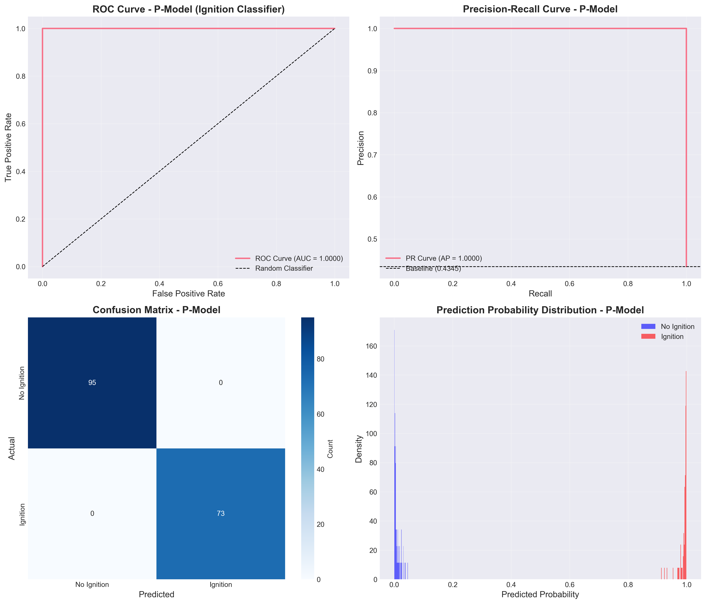
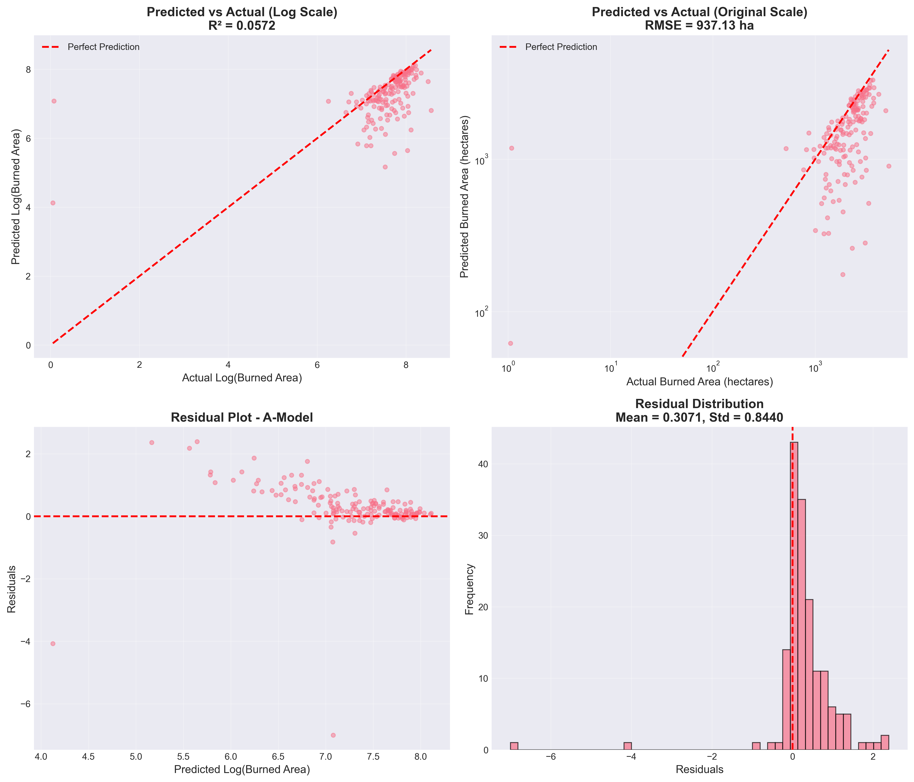
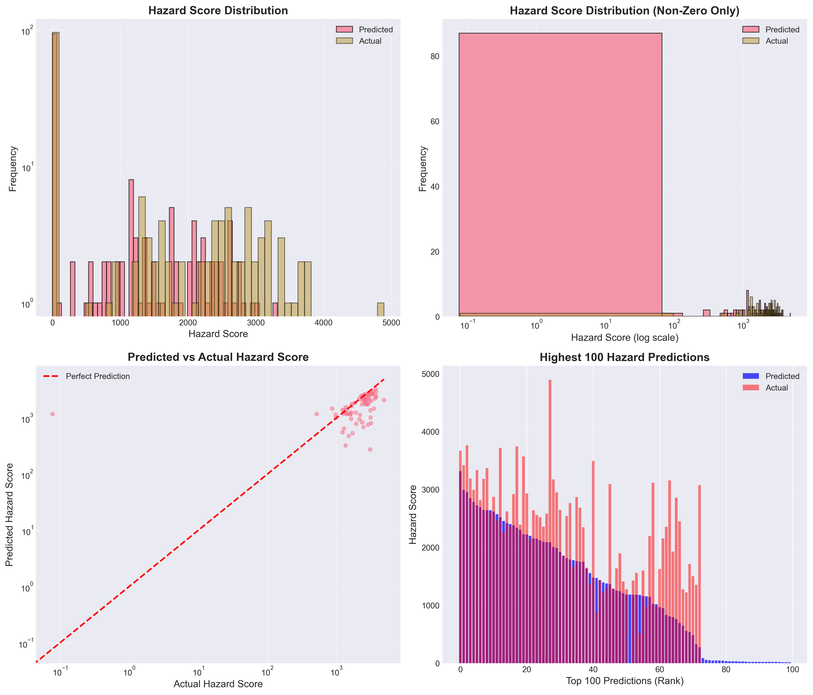

# Wildfire Risk Predictor

## What it Does

This project implements a two-head machine learning pipeline for predicting wildfire hazard using the WildfireSpreadTS dataset. The system combines a "P-model" (ignition probability classifier) and an "A-model" (conditional log burned area regressor) to compute a comprehensive hazard score as P(ignition) × E[burned_area | ignition]. The models use CNN embeddings extracted from satellite imagery and multi-modal features from geospatial data to predict both the likelihood of fire ignition and the expected burned area, enabling proactive wildfire risk assessment. The combined model results in the prediction of expected impact of potential wildfires in the US. These predictions aim to support the optimization of US wildfire management by informing fire departments of regions with the highest wildfire hazard risks.

## Quick Start

1. **Install dependencies**: `pip install -r requirements.txt`
2. **Prepare data**: Place WildfireSpreadTS dataset in `data/raw/wildfirespreadts/`
3. **Extract embeddings**: `python src/data/extract_cnn_embeddings.py`
4. **Prepare features**: `python src/data/prepare_wildfirespreadts_features.py`
5. **Split data**: `python src/data/split_data.py`
6. **Train models**: `python src/models/train_model.py`
7. **Evaluate models**: `python scripts/evaluate_both_models.py`
8. **Combine predictions**: `python src/models/combine_predictions.py`

For detailed setup instructions, see [SETUP.md](SETUP.md).

## Video Links

- **Demo Video**: https://www.youtube.com/watch?v=t6jpiYMGg5A
- **Technical Walkthrough**: https://www.youtube.com/watch?v=9XhQJX3Ij2U

## Evaluation

### P-Model (Ignition Classifier)

- **ROC-AUC**: 0.8862
- **PR-AUC**: 0.9357
- **Accuracy**: 0.8128
- **Precision**: 0.9030
- **Recall**: 0.7807
- **F1-Score**: 0.8374
- **False Positive Rate**: 5.18% (101 cases)
- **False Negative Rate**: 13.54% (264 cases)



### A-Model (Log Burned Area Regressor)

- **RMSE**: 1.369 (log scale) / 493.21 hectares (original scale)
- **MAE**: 121.61 hectares
- **R²**: 0.3190
- **Spearman Correlation**: 0.8005
- **Underestimation Rate**: 73.50% (systematic bias)



### Combined Model (Hazard Score)

- **RMSE**: 389.19 hectares
- **MAE**: 77.45 hectares
- **R²**: 0.4122
- **Spearman Correlation**: 0.8039



For more detailed analysis, see `notebooks/visualize_evaluation_metrics.ipynb`.

## Project Structure

```
├── src/
│   ├── data/          # Data preparation scripts
│   ├── models/        # Model training and evaluation
│   └── visualization/ # Analysis and visualization
├── notebooks/         # Jupyter notebooks for exploration
├── scripts/           # Convenience scripts
├── data/              # Data directory (raw/interim/processed)
└── models/final/      # Trained models and outputs
```

## Requirements

- Python 3.9+
- See `requirements.txt` for full dependency list
